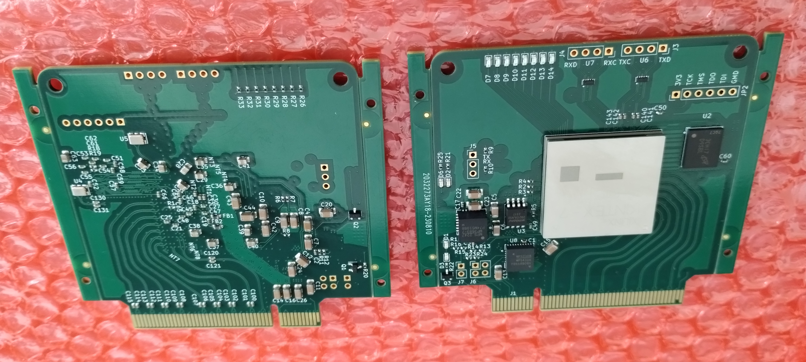

# Kintex 7 PCIe board

This repository contains KiCad 6 project of XC7K160T-based PCIe/Transceiver test board.

Features:

* 8 GTX channels via PCIe x8 edge connector
* GTX clocking with PCIe clock or onboard 125MHz oscillator
* 2 TX and 2 RX LVDS lanes on J3 and J4
* 8-bit DDR2 memory interface
* QSPI configuration flash

Notes:

* Before board becomes operational the DC-DC converter MPM54304 must be programmed with correct feedback voltages:
  * 1.8V on channel 1
  * 1.1V with 1/3 FB divider enabled and overvoltage protection disabled on channel 2
  * 1.0V on channel 3
  * 1.2V on channel 4
